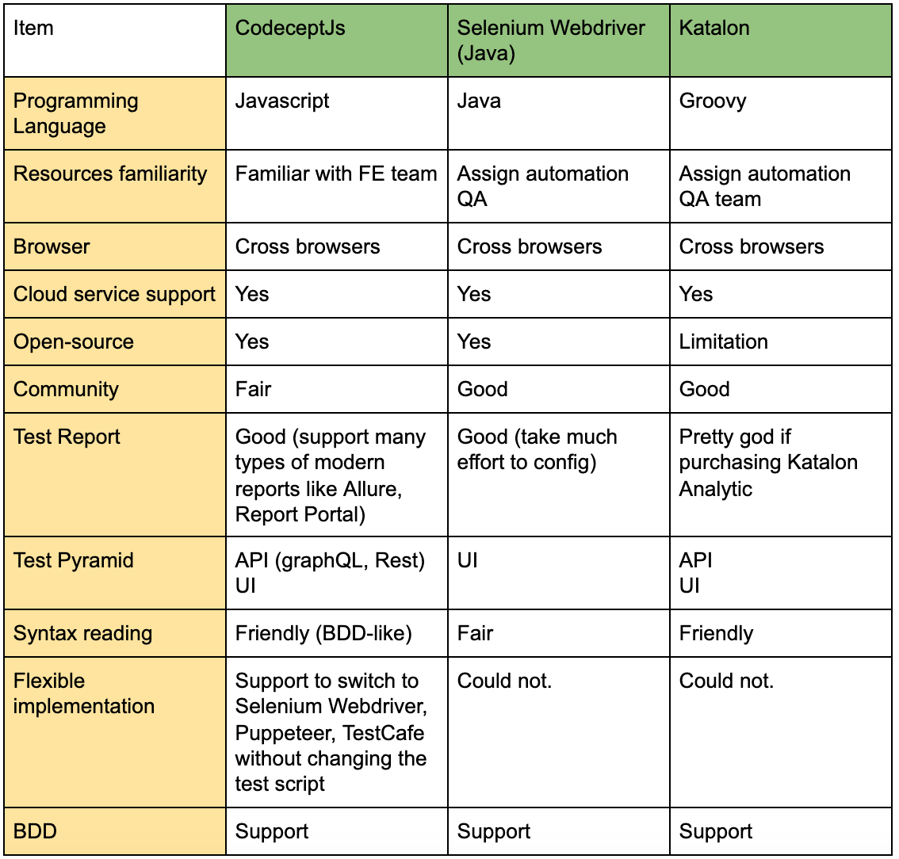

## Test Automation Approach

  - [A. Overview:](#a-overview)
  - [B. Scope](#b-scope)
  - [C. Test Schedule](#c-test-schedule)
  - [D. Design Automation framework strategy](#d-design-automation-framework-strategy)

### [A. Codeceptjs Introduction](#a-introduction): 
CodeceptJS bypasses execution commands to helpers. Depending on the helper enabled, your tests will be executed differently. If you need cross-browser support you should choose Selenium-based WebDriver or TestCafé. If you are interested in speed - you should use Chrome-based Puppeteer. Therefore, we could say this tool is very flexible and easily maintained.

### [B. Automation Tool Evaluation](#b-automation-tool-evaluation)

### [C. Conclusion](#c-conclusion)
Based on the analytic in the table above, we could say “Codeceptjs” is the winner amongst famous frameworks/tools in the market. 

POC for the Codeceptjs:
https://github.com/hungdao-testing/amazonweb
